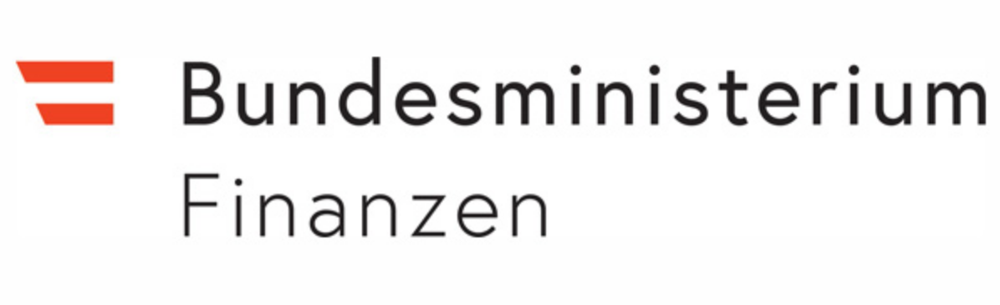

## Project Partners

[Austrian Institute of Technology GmbH](http://www.ait.ac.at) 

The AIT Austrian Institute of Technology is Austria's largest research and technology organisation. Among the European research institutes, AIT is a specialist in the key infrastructure issues of the future. AIT’s Digital Insight Lab (DIL) provides data science consulting and solutions for making informed decisions based on large, heterogeneous, and real-time data under strict conditions of IT security and data protection. The DIL is a multidisciplinary group of experienced  scientists and engineers with diverse backgrounds - from data analytics, applied mathematics and statistics, to information security, and the humanities.

[University of Innsbruck - Security and Privacy Lab](http://informationsecurity.uibk.ac.at/)

 

The Security and Privacy Lab has been established with the appointment of professor Rainer Böhme at the University of Innsbruck in March 2015. The lab is known for its interdisciplinary approach to solving exigent problems in information security and privacy, with specific emphasis on: digital forensics, steganography and steganalysis, economics of information security, virtual currencies and cryptographic financial instruments, privacy-enhancing technologies (PET), economic and behavioral aspects of information security and privacy, cybercrime.

[Xylem - Science and Technology Management GmbH](https://www.xylem-technologies.com/) 

XYLEM Technologies is an internationally operating software company located in Vienna, Austria. Since 2009 Xylem Technologies develops innovative and high-quality software solutions aiming to improve cost- and energy efficiency. The company cultivates close contact to international research facilities and operates as a pioneer with its unique software products.

[VICESSE - Vienna Centre for Societal Security](https://www.vicesse.eu/) 

Vienna Centre for Societal Security (VICESSE) is a private non-profit research organization, financed through project funds of the European Commission as well as national funds. VICESSE operates at the interface between science, technology, law and policy. 
We do research and coordinate nationally and internationally funded projects. 

[Research Institute AG & Co KG](https://www.researchinstitute.at/) 

Scientific research, primarily in the field of "fundamental rights in the digital age", is the principal activity of the Research Institute (RI). The Digital Human Rights Center is a research center at the interface of technology, law and society that deals with questions regarding the protection of fundamental rights from a multi- and interdisciplinary perspective. This includes technical, legal and organisational aspects of data protection and data security as well as questions of technology assessment, cybercrime and network policy.

[Federal Ministry of the Interior, Dept. II/BK/7](http://www.bmi.gv.at/) 

The Federal Ministry of the Interior of Austria is a federal government agency on cabinet-level, serving as the interior ministry of the Austrian Government. 
<!-- It is mainly in charge of the civilian protection, but also for affairs relating to the citizenship, elections, referendums, popular petitions and the alternative civilian service. -->

[Federal Ministry of Finance, Dept. I/9](http://www.bmf.gv.at/) 

The Federal Ministry of Finance is the cabinet-level ministry for finance of Austria. 

<!-- Über die Ressortgrenzen hinweg haben wir den internationalen und nationalen Überblick über Risiken und Betrugsfelder bei Steuer und Zoll von der Mustererkennung zur Prävention und Bekämpfung von Betrug, leisten wir Übersetzungsarbeit von der Theorie in die Praxis, kooperieren wir mit EU Institutionen, internationalen Finanzverwaltungen und verschiedenen internationalen Agenturen, identifizieren wir Betrugsszenarien, sind wir Informationsdrehscheibe, schlagen wir effiziente Maßnahmen vor, und koordinieren die Betrugsbekämpfungseinheiten der Finanzverwaltung bei der Umsetzung dieser Maßnahmen. -->

